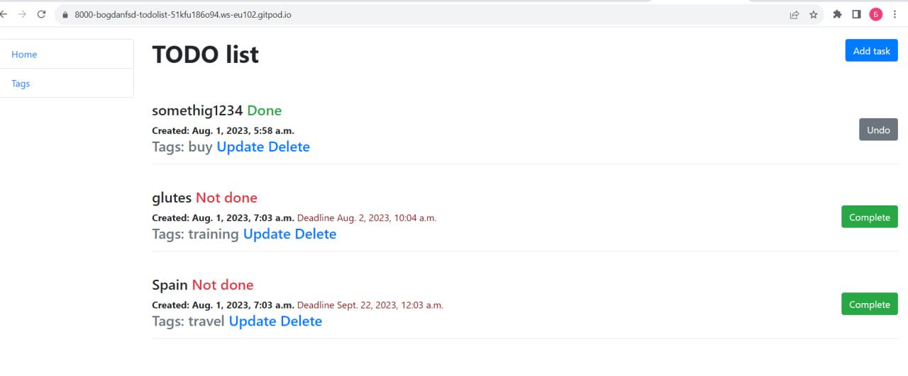
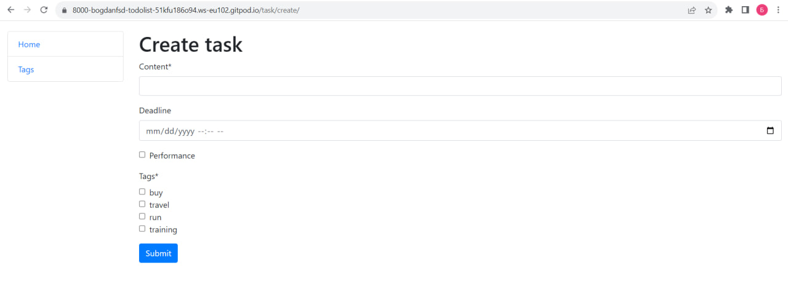
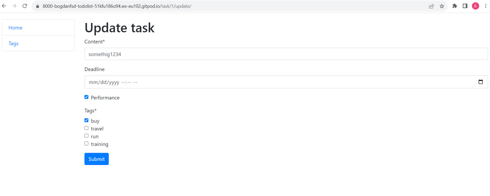
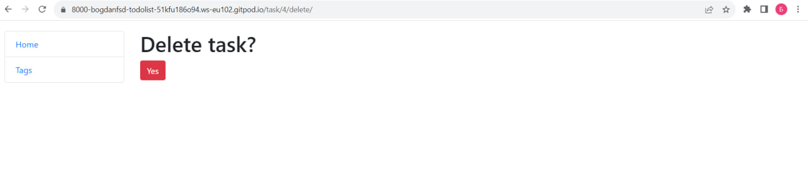
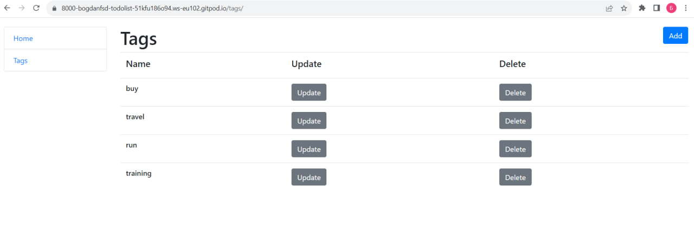
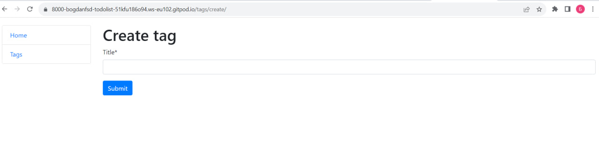
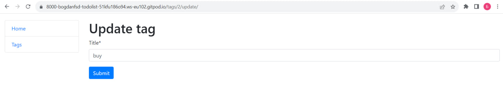
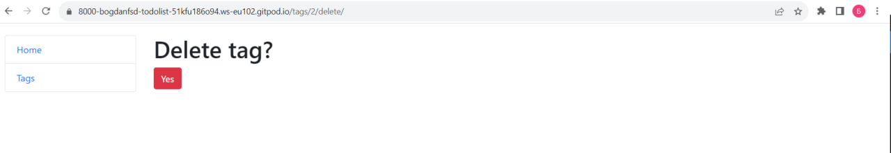

# To-Do-List
Django practice


## Technologies Used
- HTML, CSS, JavaScript for the frontend
- Python with Django framework for the backend
- SQLite3 for the database
- Bootstrap for responsive design

## Installation

* Clone repo first

```shell
git clone https://github.com/BogdanFSD/to-do-list
```

* Change directory

```shell
cd TO-DO-LIST
```

* Install virtual environment

```shell
python3 -m venv venv
```

* Activate virtual environment

```shell
venv/bin/activate
```

* Install requirements

```shell
pip install -r requirements.txt

```

* Run server

```shell
python manage.py runserver
```

### Main page 


### Create Task 


### Update Task 


### Delte Task 


### Tags Page 


### Create tag 


### Update Tag 


### Delete Tag 

